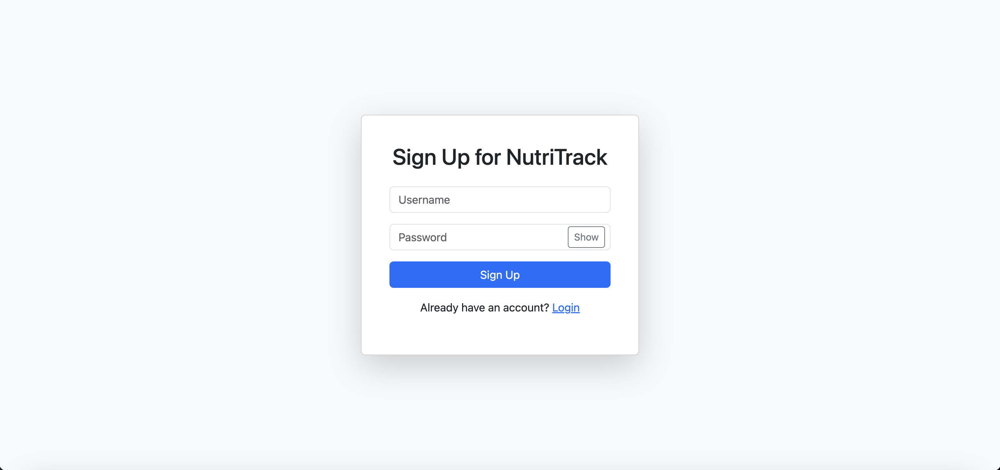
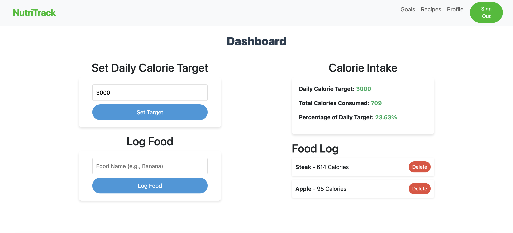
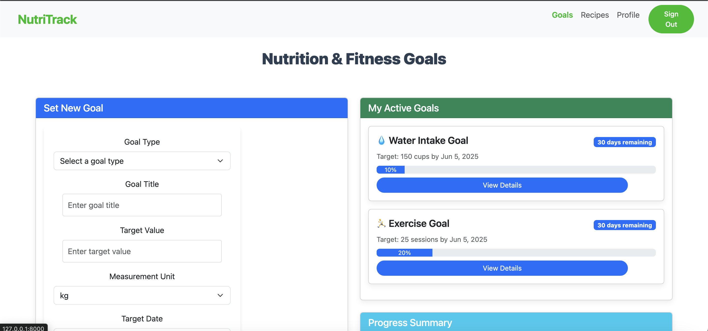
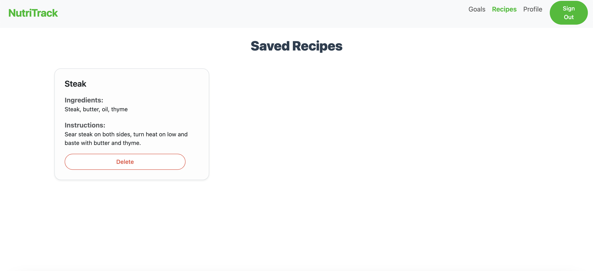
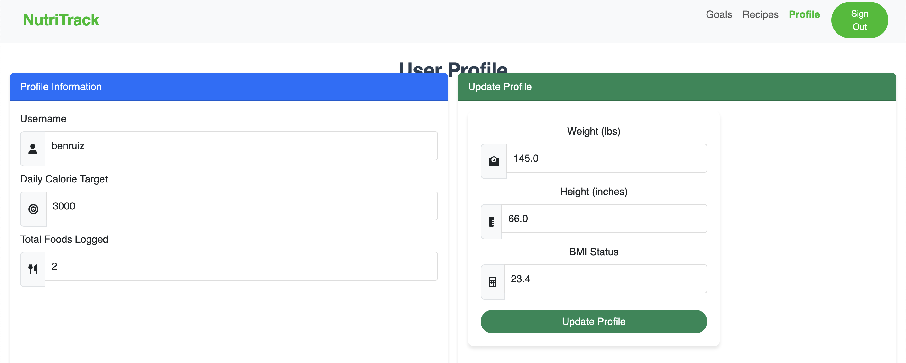

# NutriTrack – CS3980 Final Project

NutriTrack is a full-stack health and nutrition tracking web app that helps users:

- Track their daily calorie intake
- Set and manage fitness/nutrition/water goals
- Save custom meals and recipes
- View personal profile data including BMI
- Access an admin view to manage all users

---

## 🌟 Features

- **Authentication** – Sign up, login, token-based protected access  
- **Calorie Dashboard** –  
  - Set daily target  
  - Log food using Nutritionix API  
  - View calorie totals and nutrient breakdowns  
- **Goal Tracking** –  
  - Set weight, nutrition, water, and custom goals  
  - Update progress and track completion  
- **Recipes Page** –  
  - Save meals with ingredients and instructions  
  - View saved recipes in a responsive layout  
- **Profile Page** –  
  - Enter height and weight to calculate BMI  
  - View health insights  
- **Admin Panel** –  
  - View all users and their roles  
- **Responsive UI** – Built with Bootstrap 5 for mobile-friendly design

---

## 🛠 Technologies Used

### Backend:
- FastAPI (Python)
- MongoDB (Atlas)
- Pydantic

### Frontend:
- HTML, CSS, JavaScript
- Bootstrap 5

### External API:
- Nutritionix API (for food data)

---

## 🚀 Installation

```bash
# 1. Clone this repository
git clone https://github.com/tielferamil/cs3980-Final
cd cs3980-Final

# 2. Create and activate a virtual environment
# Windows
python -m venv venv
venv\Scripts\activate

# macOS/Linux
python3 -m venv venv
source venv/bin/activate

# 3. Install required packages
pip install fastapi uvicorn pymongo python-dotenv pydantic

# 4. Run the FastAPI server
uvicorn main:app --reload
```

---

## 🌐 How to Use

1. Open a browser and go to `http://localhost:8000` after starting the FastAPI server.
2. Register a new account or log in with an existing one.
3. Use the dashboard to:
   - Set your daily calorie goal
   - Log meals using the Nutritionix API
   - View your daily total calories and nutrition breakdown
4. Visit the **Goals** page to:
   - Set fitness, nutrition, water, or custom goals
   - Track and update progress
5. Go to the **Recipes** page to:
   - Save meals with ingredients and instructions
   - Browse your saved recipes
6. Update your height and weight in the **Profile** page to:
   - Automatically calculate BMI and view health insights
7. If you're an admin, access the **Admin Panel** to:
   - View all users and their roles

---

## 📸 Demo

- 🔐 Login / Signup UI
- 📊 Calorie Dashboard with food log 
- 🎯 Goals page with progress visualization 
- 🍽️ Recipes gallery 
- 👤 Profile page with BMI calculator 
